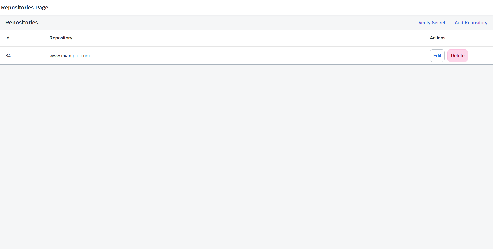
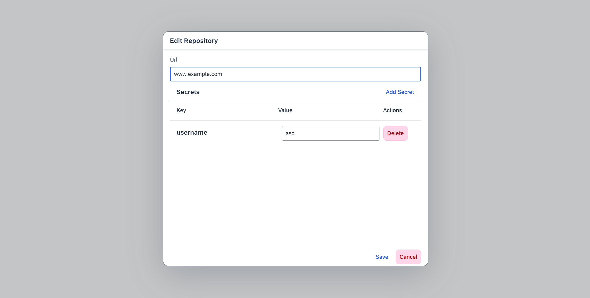
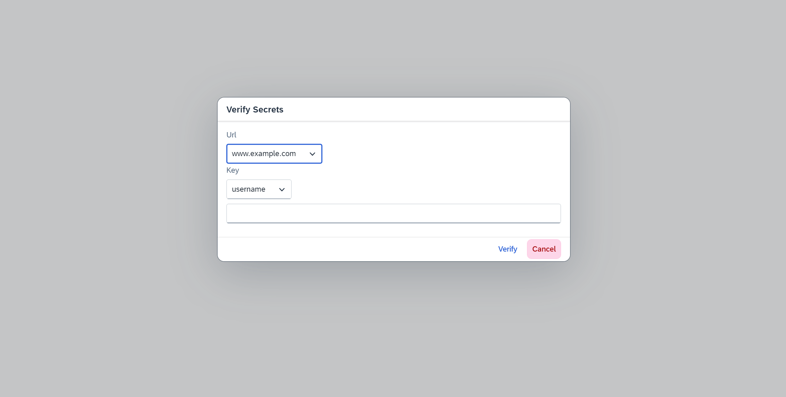

# Repository Storage

## Table of Contents
1. [Overview](#overview)
2. [Getting Started](#getting-started)
   1. [Prerequisites](#prerequisites)
   2. [Installation](#installation)
   3. [Running Locally](#running-locally)
3. [Screenshots](#screenshots)

## Overview <a name="overview"></a>
Repository Storage is a tool for securely storing and managing repository URLs and their associated authentication 
secrets, used within a CI/CD pipeline.

## Getting Started <a name="getting-started"></a>
### Prerequisites
1. <b>Java 21</b> - The project is set up to use Java 21, but you can change this in pom.xml.
2. <b>Node.js</b>
3. <b>UI5</b> - Use the following command to install UI5 locally: `npm install --global @ui5/cli`
4. <b>Set up a database</b> - The backend application is set up to use MySQL database (https://dev.mysql.com/). 
Before running it, you also need to set an environment variable called `MYSQL_ROOT_PASSWORD` to your MySQL password.
Make sure the connection string and username in the `application.properties` file are correct for your environment.
### Installation <a name="installation"></a>
#### Cloning the repository
```shell
git clone https://github.com/BozhidarVelikov/repository-storage.git
cd repository-storage
```
#### Backend Setup
Navigate to backend directory, install dependencies and package the project using Maven: 
```shell
cd backend
mvn clean install
```
#### Frontend Setup
Navigate to the frontend directory and install dependencies:
```shell
cd frontend
npm install
```

### Running Locally <a name="running-locally"></a>
#### Backend
To run the Spring Boot application locally:
```shell
cd backend
mvn spring-boot:run
```
The backend will be accessible at http://localhost:8080.

#### Frontend
To run the application locally:
```shell
cd frontend
npm start
```
The application will be accessible at http://localhost:3000.

## Screenshots <a name="screenshots"></a>



